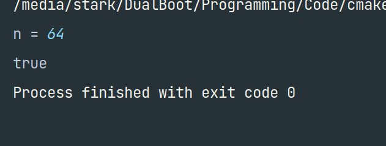
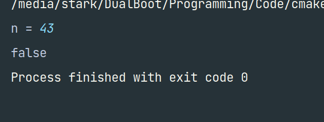
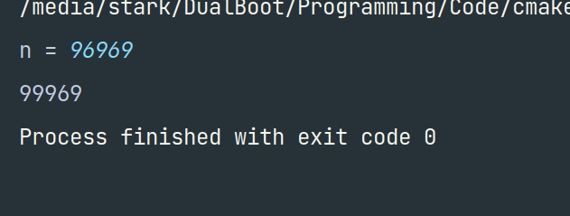
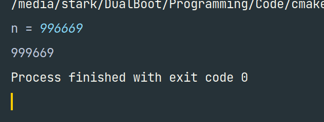

# TechnoJam Solutions

Programming Language: C++

## DSA (Easy)

### 1) _Power of 2_

**Approach**: Inititalize a number and multiply it by 2 till it is equal or bigger than the input number.

**Code**:

```
#include <iostream>

using namespace std;

int main() {
  cout << "n = " << endl;
  int num;
  cin >> num;
  int init = 2;
  bool ans = false;
  while (num >= init) {
        if (num == init) {
          ans = true;
          break;
        }
      init *= 2;
  }
  cout << boolalpha << ans;
}
```

**Screenshots**:




### 2) _69 Problems_

**Approach**: Get total digits. Use that value to divide by a particular power of 10 to get digits starting from left side (instead of the usual right side). Replace first appearance of 6 by subtracting 6`*`10^n and adding 9`*`10^n, or adding 3`*`10^n where n is the place value of digit from left side - 1. Like for 9 in 96, it will be 2 (2nd digit from left) - 1.

**Code**:

```
#include <iostream>
#include <math.h>

using namespace std;

int main() {
  cout << "n = ";
  int num;
  cin >> num;

  int digits = 0;
  int temp = num;
  while (temp > 0) {
      temp /= 10;
      digits++;
  }

  temp = num;
  while (digits != 0) {
      digits--;
      int div = pow(10, digits);
      if (temp/div == 6) {
          num += 3*div;
          break;
      }
      temp -= (temp/div)*div;
  }
  cout << num;
}
```

**Screenshots**:



