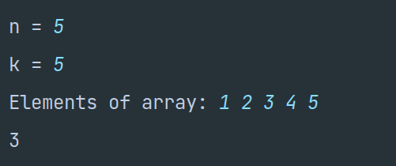

# TechnoJam Solutions

Programming Language: C++

Code is available here as well in `code` directory.

## DSA (Easy)

### 1) _Power of 2_

**Approach**: Inititalize a number and multiply it by 2 till it is equal or bigger than the input number.

**Code**:

```
#include <iostream>

using namespace std;

int main() {
  cout << "n = " << endl;
  int num;
  cin >> num;
  int init = 2;
  bool ans = false;
  while (num >= init) {
        if (num == init) {
          ans = true;
          break;
        }
      init *= 2;
  }
  cout << boolalpha << ans;
}
```

**Screenshots**:


---

### 2) _69 Problems_

**Approach**: Get total digits. Use that value to divide by a particular power of 10 to get digits starting from left side (instead of the usual right side). Replace first appearance of 6 by subtracting 6`*`10^n and adding 9`*`10^n, or adding 3`*`10^n where n is the place value of digit from left side - 1. Like for 9 in 96, it will be 2 (2nd digit from left) - 1.

**Code**:

```
#include <iostream>
#include <math.h>

using namespace std;

int main() {
  cout << "n = ";
  int num;
  cin >> num;

  int digits = 0;
  int temp = num;
  while (temp > 0) {
      temp /= 10;
      digits++;
  }

  temp = num;
  while (digits != 0) {
      digits--;
      int div = pow(10, digits);
      if (temp/div == 6) {
          num += 3*div;
          break;
      }
      temp -= (temp/div)*div;
  }
  cout << num;
}
```

**Screenshots**:


---

### 3) _Are there common factors?_

**Approach**: Create a variable (let `s`) and set it's value to the lower number. Also create another variable to count factors. Use a for loop to iterate from 1 to `s` and see if the remainder of the division of both a and b with the iterator is 0 or not. Keep adding to the `factors` variable if they are divisble else continue.

**Code**:

```
#include <iostream>

using namespace std;

int main() {
    int a, b;
    cout << "Enter a: ";
    cin >> a;
    cout << "Enter b: ";
    cin >> b;
    int lower = a < b ? a : b;
    int factors = 0;
    for (int i = 1; i <= lower; i++) {
        if (a % i == 0 && b % i == 0) factors++;
    }
    cout << factors;
}
```

**Screenshots**:


---

### 4) _Total Cuts_

**Approach**: Create a variable `cuts` to keep track of total cuts. Then start a for loop to try out all possible cuts. Create 2 variables to store value of largest number in left part and smallest number in right part of the cut. Use another for loop (nested) to get the correct value of these variable. Get their sum and compare with the `k` provided at beginning.

**Code**:

```
#include <iostream>

using namespace std;

int main() {
    int n, k;
    cout << "n = ";
    cin >> n;
    cout << "k = ";
    cin >> k;
    int arr[n];
    cout << "Elements of array: ";
    for (int i = 0; i < n; i++) cin >> arr[i];
    int cuts = 0;
    for (int i = 0; i < n-1; i++) {
        int min = arr[n-1], max = arr[0];
        for (int j = 1; j < n-1; j++) {
            if (j <= i && arr[j] > max) max = arr[j];
            else if (j > i && arr[j] < min) min = arr[j];
        }
        if (max + min >= k) cuts++;
    }
    cout << cuts;
}
```

**Screenshots**:





---

## DSA (Medium)

### 1) _Popular YouTube Creators_

**Approach**: We have 3 arrays of creators, ids and views. Create three new arrays, to store unique creators, their popularity and the id of most seen video. Loop over the first three arrays to fill the values. Now pick out the indexes of popularity array which are highest (can be multiple if equal) into a vector. Use the vector to create a new 2d array named `answers` and save the creator name and views of maximum viewed video respectively. At last display it.

**Code**:

```
#include <iostream>
#include <vector>

using namespace std;

int main() {
    int n;
    cout << "Enter value of n: ";
    cin >> n;
    string creators[n];
    string ids[n];
    int views[n];
    cout << "Enter value of each element in creators array: ";
    for (int i = 0; i < n; i++) cin >> creators[i];
    cout << "Enter value of each element in ids array: ";
    for (int i = 0; i < n; i++) cin >> ids[i];
    cout << "Enter value of each element in views array: ";
    for (int i = 0; i < n; i++) cin >> views[i];

    string unique_creators[n];
    int popularity[n];
    string max_view_ids[n];
    for (int i = 0; i < n; i++) popularity[i] = 0;
    int val = 0;
    for (int i = 0; i < n; i++) {
        bool p = false;
        for (int j = 0; j < val; j++) {
            if (unique_creators[j] == creators[i]) {
                p = true;
                break;
            }
        }
        if (p) continue;
        unique_creators[val] = creators[i];
        val++;
    }


    for (int i = 0; i < n; i++) {
        int ind = 0;
        for (int j = 0; j < val; j++) {
            if (creators[i] == unique_creators[j]) {
                ind = j;
                break;
            }
        }
        popularity[ind] += views[i];
    }

    vector<int> maxPop;
    int maxPopInd = 0;
    for (int i = 0; i < val; i++) {
        if (maxPopInd == i) continue;
        if (popularity[maxPopInd] < popularity[i]) {
            maxPopInd = i;
        }
        if (maxPopInd == i) continue;
        if (popularity[maxPopInd] == popularity[i]) {
            maxPop.push_back(maxPopInd);
            maxPopInd = i;
        }
    }
    maxPop.push_back(maxPopInd);

    for (auto i: maxPop) {
        string c = unique_creators[i];
        int maxViewsId = 0;
        for (int j = 0; j < n; j++) {
            if (creators[j] == c && views[j] >= views[maxViewsId]) {
                // Lexicographically changing
                if (views[j] == views[maxViewsId] && ids[maxViewsId][0] < ids[j][0]) continue;
                maxViewsId = j;
            }
        }
        max_view_ids[i] = ids[maxViewsId];
    }
    int winners = maxPop.size();
    string answer[winners][2];
    for (int i = 0; i < winners; i++) {
        answer[i][0] = unique_creators[maxPop[i]];
        answer[i][1] = max_view_ids[maxPop[i]];
    }

    cout << "[";
    for (int i = 0; i < winners; i++) {
        cout << "[\"" << answer[i][0] << "\", \"" << answer[i][1] << "\"]";
        if (i != winners-1) cout << ", ";
    }
    cout << "]" << endl;
}
```

**Screenshots**:


---

### 2) _Minimum Division of Groups_

**Approach**: First we create a 3d nested n\*n array with each element representing an interval (another array). Then we keep adding intervals in the 3d array's 1st element if the interval doesn't intersect. Incase it does we add the new intervals in 3d array's 2nd element and so on. Along with that we create a variable to keep count of groups. At last we print it on the console.

**Code**:

```
#include <iostream>

using namespace std;

int main() {
    int n;
    cout << "Enter number of intervals: ";
    cin >> n;
    int arr[n][2];
    cout << "Enter values of each interval (in new line)" << endl;
    for (int i = 0; i < n; i++) {
        cin >> arr[i][0] >> arr[i][1];
    }
    cout << "intervals = [";
    for (int i = 0; i < n; i++) {
        cout << "[" << arr[i][0] << ", " << arr[i][1] << "]";
        if (i != n-1) {
            cout << ", ";
        }
    }
    cout << "]" << endl;
    int lower = arr[0][0], upper = arr[0][0];
    for (int i = 0; i < n; i++) {
        for (int j = 0; j < 2; j++) {
            if (arr[i][j] <  lower) lower = arr[i][j];
            if (arr[i][j] >  upper) upper = arr[i][j];
        }
    }

    int groups[n][n][2];
    int groupItems[n];
    for (int i = 0; i < n; i++) {
        for (int j = 0; j < n; j++) {
            groups[i][j][0] = 0;
            groups[i][j][1] = 0;
        }
    }
    int groupsNum = 0;
    int first = true;
    for (int i = 0; i < n; i++) {
        int x = arr[i][0];
        int y = arr[i][1];
        if (first) {
            groups[0][0][0] = x;
            groups[0][0][0] = y;
            groupsNum++;
            groupItems[0] = 1;
            first = false;
            continue;
        }
        bool works = false;
        for (int j = 0; j < groupsNum; j++) {
            int worksHere = true;
            for (int k = 0; k < groupItems[j]; k++) {
                if (!(y < groups[j][k][0] || x > groups[j][k][1])) {
                    worksHere = false;
                    break;
                }
            }
            if (worksHere) {
                groups[j][groupItems[j]][0] = x;
                groups[j][groupItems[j]][1] = y;
                groupItems[j]++;
                works = true;
                break;
            }
        }
        if (!works) {
            groups[groupsNum][0][0] = x;
            groups[groupsNum][0][1] = y;
            groupItems[2] = 1;
            groupsNum++;
        }
    }
    cout << groupsNum;
}
```

**Screenshots**:


